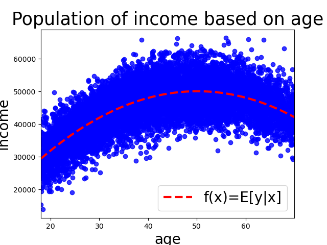

---
title:
- Empirical Evaluation of Management Practices I
subtitle:
- Predictions and Machine Learning
author:
- Prof. Dr. Dirk Sliwka
- Jesper Armouti-Hansen
date:
- 17/11/20
theme:
- Copenhagen
---

# Content
1. Introduction to Machine Learning
2. Regression
3. Classification
4. Model Selection and Assessment
5. Decision Trees and Random Forests

# 1. Introduction to Machine Learning
## General definition
_[Machine Learning is the] field of study that gives computers the ability to learn without being explicitly programmed._

- (Arthur Samuel, 1959)

## More specific definition
_A computer program is said to learn from experience $E$ with respect to some task $T$ and some performance measure $P$, if its performance on $T$, as measured by $P$, improves with experience $E$._

- (Tom Mitchell, 1997)

# Types of Machine Learning
**Supervised Learning:**

The task of learning a function that maps the input(s) $X$ to an output $y$ based on example input-output pairs.

+ Regression: The output is continuous or discrete and ordered.
	+ Example: Predicting house prices based on house characteristics.
+ Classification: The output is a discrete and unordered set.
	+ Example: Classifying an email as spam or ham based on the use of certain words.

_This is a "mini-course" on supervised learning with Python._

#
**Unsupervised Learning:**

We observe inputs but no output. We can seek to understand the relationship between the variables or the observations.

+ For example, we might observe multiple characteristics for potential customers.
	+ We can then try to cluster potential customers into groups based on these characteristics
+ We might also try to project our inputs into a lower dimensional space.
	+ This can be a beneficial pre-processing for supervised learning when dealing with high-dimensional data.

_We will not deal with unsupervised learning in this course._

# Terminology
_The terms used in the ML literature differs slightly from that used in Econometrics:_

+ Supervised learning → _Regression, classification, predicting $y_i$ given $x_i$._
+ Features → $x_i$_, independent variables, explanatory variables, regressors, predictors._
+ Target → $y_i$_, dependent variable._
+ Training → _Estimating a model._
+ Testing → _Evaluating a model._
+ Training data → _The sample we use to train our model._
+ Test data → _The sample we use to test our model._

# 2. Regression
Let us start with an example:

+ Suppose our task is to predict income based on a person's age and that we had data on the whole population:

{ width=60% }

+ What would be a "good" prediction here?

# More formally

+ Let $X_i$ be a random vector (i.e. the vector of features).
+ Let $Y_i$ be a real variable (i.e. the response).
+ We are interested in a function $f(X_i)$ which makes "good" prediction about $Y_i$.
+ To know what a "good" prediction is, we require a loss function: $L(Y_i,f(X_i))$ which penalizes bad predictions
	+ Common choice: Squared error -- penalizes the quadratic distance:
\begin{equation}
L(Y_i , f(X_i)) = (Y_i - f(X_i))^2
\end{equation}

#
Recall from the lecture on Part 2:

::: {.block}
## CEF Prediction Property
Let $f(X_i)$ be any function of $X_i$. The conditional expectation function (CEF) solves:
\begin{equation}
E[Y_i | X_i] = \arg\min_{f(X_i)}E[(Y_i - f(X_i))^2]
\end{equation}
:::

+ Thus, in terms of prediction, we can do no better than the CEF
+ Also, recall:

::: {.block}
## CEF Decomposition Property
We can decompose $Y_i$ such that
\begin{equation}
Y_i = E[Y_i | X_i] + \epsilon_i
\end{equation}
Where:

1. $\epsilon_i$ is mean independent of $X_i$: $E[\epsilon_i|X_i]=0$.
2. $\epsilon_i$ is uncorrelated with any function of $X_i$.
:::

#
Thus, if we knew the population, calculating the CEF is usually not a difficult task:

{ width=60% }

We just predict the average income for people of the same age.

+ In this case, we are dealing with simulated data with the following conditional expectation function:
	\begin{equation}
	f(income)=2000*age - 20*age^2
	\end{equation}
